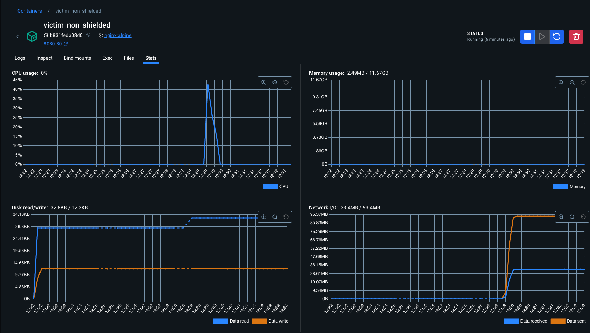
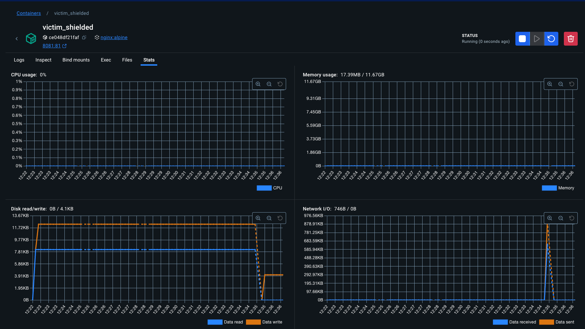
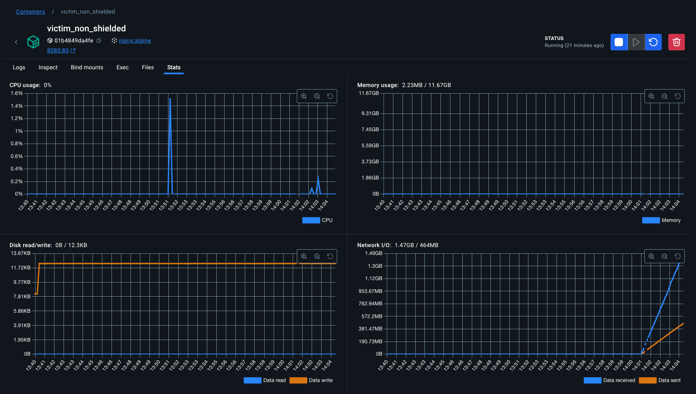
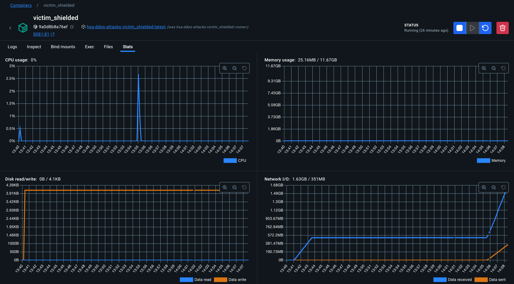
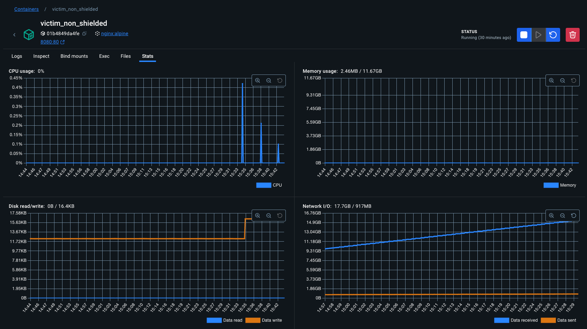

# hsa-ddos-attacks

# Task
1. Setup two docker containers:
   - Attacker container - there you need to write scripts that will implement 6 attacks (UDP Flood, ICMP flood, HTTP flood, Slowloris, SYN flood,  Ping of Death) 
   - Defender container - ubuntu & nginx with simple website.
2. Try to implement protection on Defender container.
3. Launch attacker scripts and examine you protection.

# Results

## HTTP flood

### Mechanism 
Send big amount of default GET requests to target resource

### No protection

1. Enter attacker container console and execute command `./http-flood.sh victim_non_shielded:80`
2. Output 
   1. ```
      {       
           "transactions":                        61564,
           "availability":                        98.05,
           "elapsed_time":                        22.85,
           "data_transferred":                    56.72,
           "response_time":                        0.09,
           "transaction_rate":                  2694.27,
           "throughput":                           2.48,
           "concurrency":                        237.13,
           "successful_transactions":             61564,
           "failed_transactions":                  1224,
           "longest_transaction":                  1.50,
           "shortest_transaction":                 0.01
      }
3. 

### With protection

1. Enter attacker container console and execute command `./http-flood.sh victim_shielded:81`
2. Output
   1. ```
      {
        "transactions":                           36,
        "availability":                         2.78,
        "elapsed_time":                         5.02,
        "data_transferred":                     0.27,
        "response_time":                        5.72,
        "transaction_rate":                     7.17,
        "throughput":                           0.05,
        "concurrency":                         41.05,
        "successful_transactions":                36,
        "failed_transactions":                  1258,
        "longest_transaction":                  5.02,
        "shortest_transaction":                 0.00
      }
3. 
4. Error observed in victim_shielded nginx container `[error] 32#32: *1269 limiting requests, excess: 20.950 by zone "one", client: 172.16.30.2, server: , request: "GET / HTTP/1.1", host: "victim_shielded:81"`


## ICMP flood

### Mechanism
Send Internet Control Message Protocol (ICMP) echo request packets (pings) to target resource

### No protection
1. Enter attacker container console and execute command `./icmp-flood.sh 172.16.30.3 80`
2. Try to navigate to `localhost:8080` from host machine - not reachable cause of nginx server is overloaded
3. Interesting observation - `localhost:8081` - also not reachable, despite it is served by another nginx server

### With protection
1. Enter attacker container console and execute command `./icmp-flood.sh 172.16.30.4 81`
2. Try to navigate to `localhost:8080` & `localhost:8081` from host machine - resource is available

### Solution

Add iptables config to limit ICMP packets to 1/sec (at container start/build up)
```
iptables -A INPUT -p icmp --icmp-type echo-request -m limit --limit 1/second --limit-burst 10 -j ACCEPT
iptables -A INPUT -p icmp --icmp-type echo-request -j DROP
```

## Ping of death

### No protection & with protection
1. Enter attacker container console and execute command `./ping-of-death.sh victim_non_shielded:80`
2. Enter attacker container console and execute command `./ping-of-death.sh victim_shielded:81`

### Observation
Both servers are reachable and homepage accessible

### Solution
Patch for this attack was released in 1997


## Slowloris

### Mechanism
Slowloris tries to keep many connections to the target web server open and hold them open as long as possible.

### No protection
1. Enter attacker container console and execute command `./slowloris.sh victim_non_shielded:80`
2. Output
   3. ```        
      slowhttptest version 1.9.0  
      test type:                        SLOW HEADERS
      number of connections:            1000
      URL:                              http://victim_non_shielded:80/
      verb:                             GET
      cookie:                           
      Content-Length header value:      4096
      follow up data max size:          52
      interval between follow up data:  10 seconds
      connections per seconds:          200
      probe connection timeout:         5 seconds
      test duration:                    240 seconds
      using proxy:                      no proxy
      
      Sat Oct 12 10:52:37 2024:
      slow HTTP test status on 50th second:
      initializing:        0
      pending:             0
      connected:           510
      error:               0
      closed:              490
      service available:   NO
3. Result - service was unreachable during attack was in progress

### With protection
1. Enter attacker container console and execute command `./slowloris.sh victim_shielded:81`
2. Output
   3. ```        slowhttptest version 1.9.0
      test type:                        SLOW HEADERS
      number of connections:            1000
      URL:                              http://victim_shielded:81/
      verb:                             GET
      cookie:                           
      Content-Length header value:      4096
      follow up data max size:          52
      interval between follow up data:  10 seconds
      connections per seconds:          200
      probe connection timeout:         5 seconds
      test duration:                    240 seconds
      using proxy:                      no proxy
      
      Sat Oct 12 10:55:24 2024:
      slow HTTP test status on 15th second:
      
      initializing:        0
      pending:             0
      connected:           351
      error:               0
      closed:              649
      service available:   YES
      
      Sat Oct 12 10:55:26 2024:
      Test ended on 17th second
3. Result - resource was reachable all time

### Solution
Add next instructions to nginx config
```
# Timeouts to protect from Slowloris
        client_body_timeout 10s;
        client_header_timeout 10s;
        keepalive_timeout 5s 5s;
        send_timeout 10s;
```

## Syn flood

### Mechanism
In a SYN flood attack, the attacker does not respond with a final ACK. The server is left with a large number of unfinished SYN-ACK requests that burden the system.

### No protection
1. Enter attacker container console and execute command `./syn-flood.sh victim_non_shielded 80`
2. 

### With protection
1. Enter attacker container console and execute command `./syn-flood.sh victim_shielded 81`
2.  (trail data on the left - is from previous tests)

## UDP flood

### Mechanism
The host checks the ports for the appropriate applications. When no application can be found, the system responds to every request with a “destination unreachable” packet.

### No protection
1. Enter attacker container console and execute command `./udp-flood.sh victim_non_shielded 80`
2. 
3. Result - though didn't manage to disable server